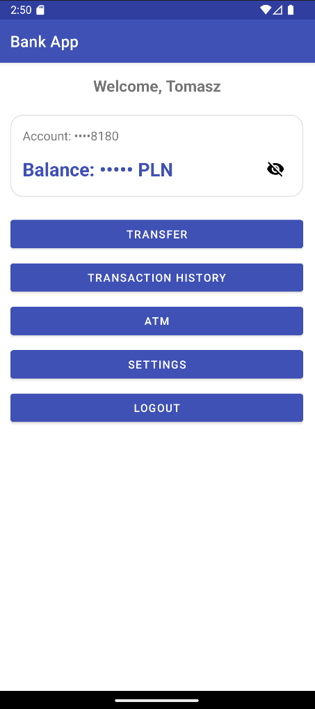
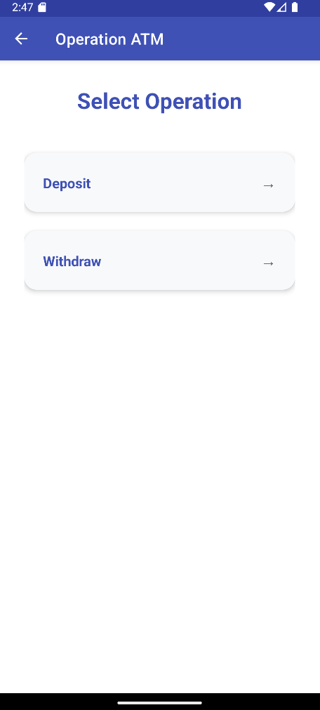
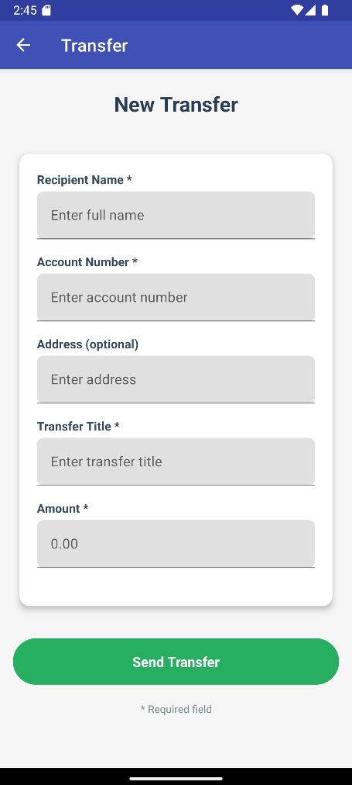
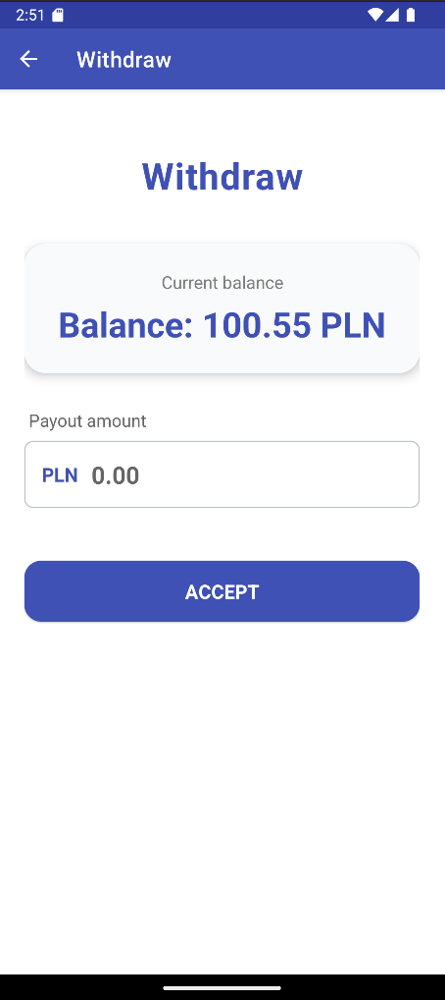
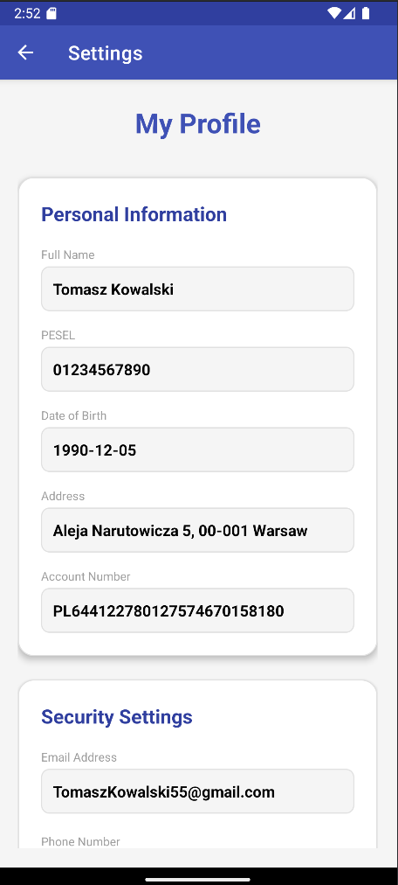
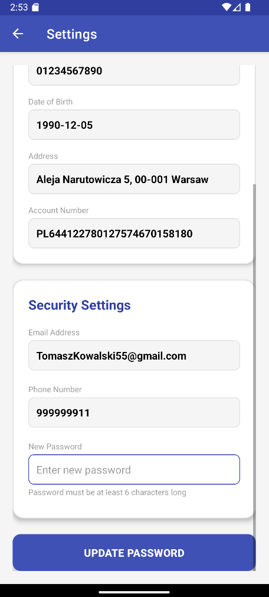

bank-app-project

Mobile aplication build android (Java) and Spring boot backend. 
Basic activities such as logging in, creating an account , transfer and history transaction.

1. Features
   
- User login
- Create account
- Balance account
- Transfer
- History tansaction
- Settings profile
- Backend Rest API
- ATM simulator

2. Technologies

- Java 
- Spring Boot
- Gradle
- Docker
- XML layout
- Android SDK
- Hibernate / JPA
- MySql (container on docker)
- Rest API

3. Future implementation

- Recovery password
- Currency exchange
- Notifications
- Virtual Card 

  

  

  

