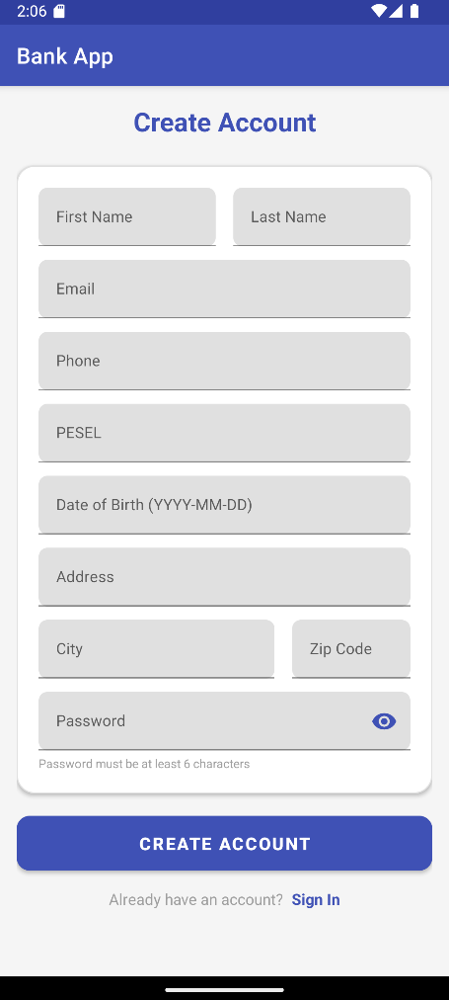
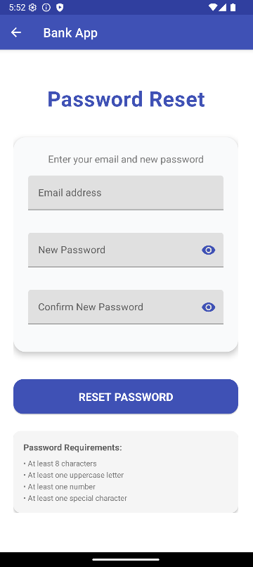
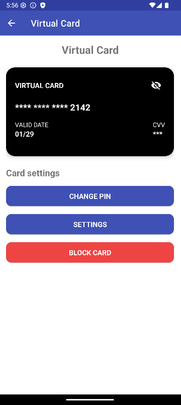
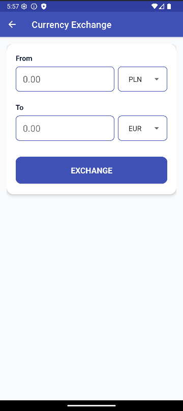
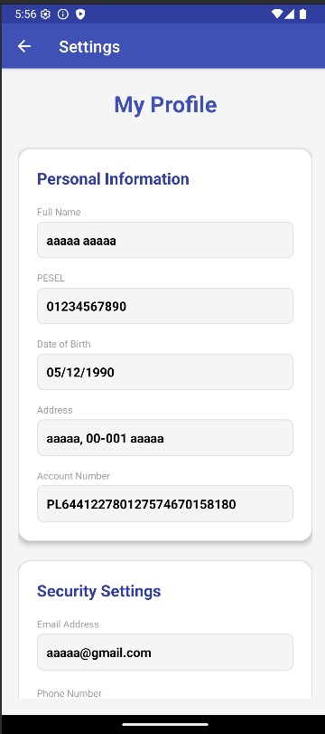
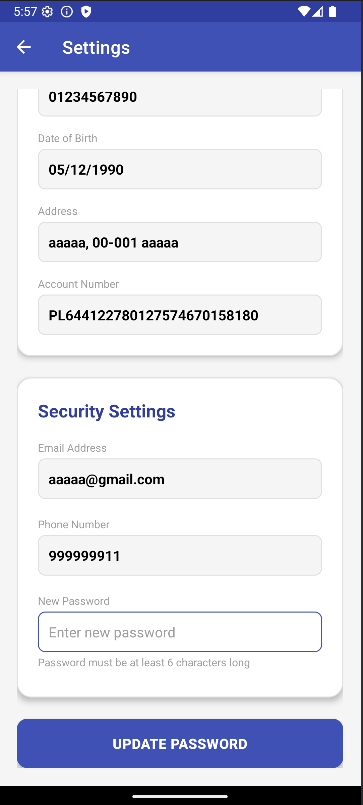

   bank-app-project

Mobile aplication build android (Java) and Spring boot backend. 
Basic activities such as logging in, creating an account , transfer and history transaction.

#1. Features
   
- User Authentication: Secure login system
- Account Management: Create and manage bank accounts
- Balance Overview: Real-time account balance display (PLN, USD, EUR)
- Fund Transfers: Send money between accounts
- Transaction History: View past transactions
- Profile Settings: User profile customization
- ATM Simulator: Simulated ATM functionality   
- Virtual Card: Generate and manage virtual payment cards

- Backend REST API: Full-featured Spring Boot API
- Database Integration: MySQL with Hibernate/JPA
- Containerization: Docker for database management

#2. Technologies

- Java 
- Spring Boot
- Gradle
- Docker
- XML layout
- Android SDK
- Hibernate / JPA
- MySql (container on docker)
- Rest API
  
Requirement: JDK 17, Docker 20.10, Gradle 7.0

#3. User Experience
   
1. Registration → Create account with personal details
2. Login → Secure authentication
3. Dashboard → Overview of balances and quick actions
4. Transactions → View and filter transaction history
5. Transfers → Send money to other accounts
6. ATM Operations → Simulate deposit/withdraw operations
7. Currency Exchange → Convert between currencies
8. Virtual Card → Generate and manage payment cards
9. Profile Settings → Update personal information

#4. Installation and Run

Backend Setup (Spring Boot)

1. Navigate to backend directory:
cd bank-app-backend

2. Run backend:
**Using Gradle Wrapper:**
./gradlew bootRun
**Windows:**
gradlew bootRun

3. Backend details:
- **Base URL:** http://localhost:8080
- **Java version:** 17
- **Framework:** Spring Boot 3

Android App Setup

1. Open project in Android Studio:
Open `bank-app-project`

2. Configure API URL in `RetrofitClient.java`:
http://10.0.2.2:8080

3. Build & Run:
- Select emulator or device
- Click **Run ▶**

Test Account

Use account for testing: 
- Email: aaaaa@gmail.com
- Password: Mango123

Run Order 
1. Run Spring Boot backend 
2. Run Android application

Troubleshooting

Backend cannot connect to database
- Make sure Docker container is running
- Check MySQL configuration

Android app cannot reach backend
- **Emulator:** use `10.0.2.2`
- **Physical device:** use local IP
- Ensure backend is running on port 8080

  

  

